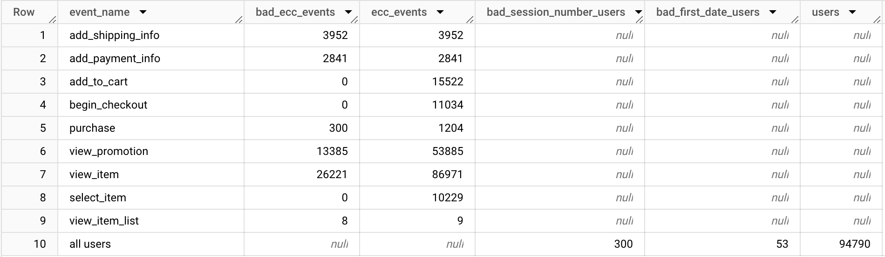

<<<<<<< HEAD
# GA4 General Tests for Dataform (alpha)
This package deploys a set of tests for Google Analytics 4 (GA4) in Dataform within the Google Cloud Platform (GCP).
The tests currently cover different quality aspects:
- Standard GA4 e-commerce events like "purchase" or "item_view"
- Missing ids like ga_session_id or user_pseudo_id
- Sessions quality: sessions which are longer than 8 hours or missing session_start events
## Getting Started
In Dataform packages are installied similar to other nodejs apps.

1. Install the package in the dependencies object inside the package.json 
```
"dataform-ga4-tests": "https://github.com/Liscor/dataform-ga4-tests/archive/refs/tags/ap-training.tar.gz"
```
2. To call the package you need to require the package and call the function. The function takes date_start, date_end defines date range for the source data. In the GA4 object the GA4 source dataset needs to be defined with project,dataset and table. It is advised to use the wildcard operator in connection with the table name exp. "events_*"
If no parameters are provided the Google Analytics 4 dataset from the Google Merchandise Store is being used as an example instead. 
```
const tests = require("dataform-ga4-tests");
tests({
    date_start: "20210101",
    date_end: "20210601",
    ga4:{
        project: "bigquery-public-data",
        dataset: "ga4_obfuscated_sample_ecommerce",
        table: "events_*",
    }
});
```

=======
# Google Analytics 4 Testing Package for Dataform
This is a package for Dataform in Google Cloud Platform. When imported to your GCP project this package will build different SQL files to test the dataquality of your GA4 property.  

## Getting Started
Requirements: 
- GA4 raw data in BigQuery
- GCP Editor access
- Activated Dataform 

### Import the package 
1. In package.json you add tar.gz from the latest release
    ``` javascript
    {
        "dependencies": {
            "ga4-tests": "https://github.com/Liscor/dataform-ga4-tests/archive/refs/tags/ap-training.tar.gz"
        }
    }
    ```
1. You require the package and call the function with your GA4 BigQuery dataset. Set date_start and date_end to specify the amount of data you want to ingest. Define your GA4 raw dataset in the ga4 object.
You can try the tests without having your own GA4 raw data if dont declare a ga4 object the public GA4 dataset from the Google Merchandise Store will be used.
    ``` javascript
    const tests = require("ga4-tests");
    tests({
        date_start: "20210101",
        date_end: "20211231",
        ga4:{
            project: "GCP_PROJECT",
            dataset: "DATASET_ID",
            table: "events_*",
        }
    });
    ```
## What is being tested?
GA4 data often is very custom so this package only tests for basic integrity. This currently covers the following:
- Standard E-Commerce Events: exp. "purchase", "view_item",...
- Session Quality: Session length, session_start event
- Missing IDs: user_pseudo_ids, ga_session_id

When the tests ran you can check the view "overview" within the ga4_testing dataset in BigQuery to see the share of bad events or missing IDS in comparision to all events,sessions and users.


>>>>>>> refs/heads/main

